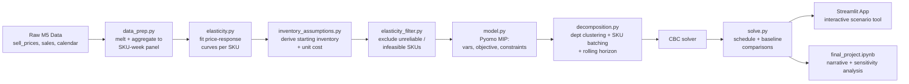

# markdown-price-optimizer

MIP model for retail markdown scheduling — optimal weekly discount tiers per SKU to maximize revenue before a clearance deadline. Built with Pyomo, CBC, and Streamlit.

[](https://github.com/hkbuttar/markdown-price-optimizer/actions/workflows/tests.yml)
[](https://markdown-price-optimizer.streamlit.app/)
[](LICENSE)

## Overview

Retailers carrying seasonal or perishable-demand inventory must repeatedly decide how deeply to discount each product, each week, in the remaining selling window. This project formulates that decision as a Mixed-Integer Program (MIP): a discrete price-tier selection per SKU per week, subject to inventory conservation, a clearance deadline, monotonic pricing, and a margin floor, with demand response to price approximated as a piecewise-linear curve.

Because solving all SKUs jointly at full weekly granularity is computationally impractical, the model uses a hybrid approach: SKUs are clustered by department, further split into manageable batches, and solved with a rolling-horizon decomposition — each sub-problem solved to proven optimality, stitched together heuristically.

**Result:** across 4,834 modeled SKU-store pairs, the MIP-optimized schedule recovers **23.6% more revenue** than a naive flat-discount policy and **12.0% more** than a calendar-based markdown schedule.

## Live Demo

**[Try the app →](https://markdown-price-optimizer.streamlit.app/)**

Upload an inventory/price file and get back a recommended weekly markdown calendar — no local setup required.

## How the Pipeline Works, Step by Step

The project is a sequence of scripts in `src/`, each one reading the previous step's output and writing a new file for the next step. Running them in order, from raw data to final results, looks like this:

### 1. `data_prep.py` — build the SKU-week panel

**What it does:** Reads the three raw M5 files (`sell_prices.csv`, `sales_train_evaluation.csv`, `calendar.csv`), melts the wide sales file (one row per item-store, one column per day) into long format (one row per item-store-day), joins in real calendar dates and event/SNAP flags, joins in weekly prices, and aggregates everything up to **SKU-week grain** — since the pricing decision this project optimizes is made weekly, not daily.

**Why it's built this way:** The raw sales file is too large to melt in one pass across every category at once without risking memory issues on a laptop, so the script processes one category at a time, converts columns to memory-efficient dtypes (`category`, `int16`, `float32`), and discards intermediate frames between categories.

**Input:** `data/raw/sell_prices.csv`, `data/raw/sales_train_evaluation.csv`, `data/raw/calendar.csv`
**Output:** `data/processed/sku_week_panel.csv` (8,476,220 rows spanning 3,049 items × 10 stores)

```bash
python -m src.data_prep
```

### 2. `elasticity.py` — estimate price sensitivity per SKU

**What it does:** For every item-store pair, fits a log-log regression — `log(units_sold + 1) = β₀ + β₁·log(price) + β₂·has_event` — to estimate that SKU's own price elasticity of demand (β₁). Item-store pairs with fewer than 10 observations, or a degenerate fit (e.g. constant price with no variation to learn from), fall back to a department-level pooled estimate instead of being dropped.

**Why it's built this way:** Fitting one curve per SKU (rather than one curve per department) lets the optimizer respond to each product's actual price sensitivity, which is the whole point of the model — but many SKUs in M5 have limited real price movement in their history, so a pure per-SKU approach without a fallback would leave a large share of the catalog with no usable estimate at all.

**Input:** `data/processed/sku_week_panel.csv`
**Output:** `data/processed/elasticities.csv` (one fitted curve per item-store pair, with an `r2` and `fit_level` column documenting fit quality and whether it used its own data or the department fallback)

```bash
python -m src.elasticity
```

### 3. `elasticity_filter.py` — exclude unreliable or nonsensical fits

**What it does:** Not every fitted elasticity curve from Step 2 is trustworthy enough to build a pricing decision on top of. This script excludes a SKU from modeling if it fails any of three checks:
1. **R² ≥ 0.10** — the fit explains a minimally reasonable share of the variation in demand.
2. **Elasticity is negative and not implausibly extreme** (between -10 and 0) — demand must fall as price rises, which is the economically sensible direction; a positive elasticity is a sign of overfitting sparse data, not a real relationship.
3. **Structural feasibility** — the SKU's own best-case demand curve must be able to plausibly sell 95% of its assumed starting inventory within its available time horizon; otherwise the model would be asked to solve an impossible clearance target.

**Why it's built this way:** Early testing showed that a single bad SKU — one with a nonsensical fitted curve — could make an entire department's joint MIP infeasible, since all SKUs in a department are solved together in one solver call. Rather than let one broken estimate silently sink dozens of good ones, this step scopes the model down to the subset of the catalog where the underlying data actually supports a reliable pricing decision, and reports exactly how many SKUs were excluded and why.

**Input:** `data/processed/model_ready_panel.csv` (produced by Step 4 below)
**Output:** `data/processed/model_ready_panel_filtered.csv`, plus printed statistics (of 30,490 total SKUs: 22,658 excluded for low R², 2,998 excluded for implausible elasticity, 0 excluded for structural infeasibility, 4,834 kept — 15.9% of the catalog)

```bash
python -m src.elasticity_filter --min-r2 0.10
```

### 4. `inventory_assumptions.py` — derive starting inventory and unit cost

**What it does:** M5 does not include real inventory levels or unit costs (retailers don't publish that alongside a public forecasting dataset), so this script derives both as transparent, documented assumptions calibrated off each SKU's own data rather than arbitrary constants:
- **Starting inventory** = 4 weeks-of-supply × that SKU's own average weekly units sold, with a floor of 5 units.
- **Unit cost** = 60% of the SKU's base price (a 40% assumed margin).

**Why it's built this way:** Since there's no real inventory or cost data to fall back on, the assumption is scaled to each SKU's *own* demand pattern rather than using one flat number for every product — a slow-moving item and a fast-moving item get proportionally different assumed starting inventory, which is a more defensible modeling choice than a single constant applied catalog-wide.

**Input:** `data/processed/sku_week_panel.csv`, `data/processed/elasticities.csv`
**Output:** `data/processed/model_ready_panel.csv`

```bash
python -m src.inventory_assumptions --inventory-weeks 4
```

*(Note: Step 3 depends on this step's output, so in practice this runs before Step 3 despite being listed after it here for narrative order — the actual run order is: data_prep → elasticity → inventory_assumptions → elasticity_filter.)*

### 5. `model.py` — the MIP formulation

**What it does:** Defines and solves the actual optimization problem for a given set of SKUs over a shared time horizon:
- **Objective:** maximize total recovered revenue.
- **Decision variable:** a binary selection, per SKU per week, of one discount tier from a fixed ladder (0%, 10%, 20%, 30%, 50% off).
- **Constraints:** inventory conservation (can't sell more than what's in stock), an end-of-horizon clearance requirement (≥95% of starting inventory sold by the deadline, with a salvage-value penalty on any remainder), monotonic pricing (discount depth can never decrease week over week), and a margin floor (price can't drop below cost + minimum margin, except a designated final emergency-clearance week).

**Why it's built this way:** Because the discount ladder is already a small, discrete set of choices, each tier's expected demand is a known constant (looked up from that SKU's fitted elasticity curve in Step 2) rather than a continuous function of price — this keeps the whole model linear (no `price × units_sold` multiplication anywhere), which is what makes it solvable at scale by an open-source MIP solver (CBC) instead of requiring a much slower nonlinear solver.

**Used by:** `decomposition.py` (Step 6) — this file is never run standalone against the full catalog; it's the sub-solver that gets called on small, manageable slices of SKUs and weeks at a time.

### 6. `decomposition.py` — solving at scale

**What it does:** Solving every SKU jointly across the full multi-year horizon in one `model.py` call is computationally impractical — the number of binary variables grows too fast for a MIP solver to handle in reasonable time. This script breaks the full problem into three layers:
1. **Department clustering** — SKUs are grouped by `dept_id` (a natural, pre-existing grouping in the data) and solved as independent sub-problems, since price decisions in unrelated departments are assumed not to meaningfully interact.
2. **SKU batching within department** — departments with more than 100 SKUs are further split into batches, since testing showed that solving 100+ SKUs jointly within one time window stopped scaling linearly and became a genuine bottleneck.
3. **Rolling horizon** — within a batch, an 8-week window of the full horizon is solved exactly, only the first 4 weeks are locked in ("committed"), inventory is rolled forward using the *actual* committed sales, and the window slides forward to repeat. The 95% clearance requirement is only enforced on the final window that reaches the true end of the horizon — earlier windows have more time remaining to sell through, so they aren't held to that bar yet.

**Why it's built this way:** Each individual sub-solve (one department's batch, one rolling window) is still solved to proven optimality by CBC — nothing is approximated at that level. What's heuristic is *how* the sub-solves are stitched together: committing only part of each window's plan and re-solving as new information (updated inventory) becomes available trades guaranteed global optimality for real tractability, which is the honest, explicit trade-off this project argues for. A cross-window monotonicity floor is also carried forward here — see the note below.

**Input:** the filtered, model-ready panel from Step 3
**Output:** a combined schedule (one row per SKU-week-tier actually committed) and a total objective value, returned in Python — saved to disk by Step 7 below

### 6a. A bug that was caught and fixed here

An earlier version of this decomposition enforced monotonic (non-increasing) pricing only *within* each rolling window, but nothing stopped price from illegally resetting back toward full price the moment a new window began solving fresh. This was caught by visually plotting a sample SKU's actual output schedule — price appeared to rise partway through the horizon, which should be structurally impossible given the model's own constraint. The fix carries each SKU's last *committed* discount tier forward as a floor for the next window's solve, and is covered by a dedicated regression test (`test_rolling_horizon_solve_is_monotonic_across_window_boundaries`) that specifically checks monotonicity across window boundaries, not just within one window. The fix cost a small, honest reduction in total recovered revenue (~0.55%, from $440,633 to $438,202) — the true cost of correctly enforcing a constraint that was previously being silently violated.

### 7. `solve.py` — the full run, with baselines

**What it does:** The top-level script that ties everything together: loads the filtered, model-ready panel, optionally narrows it to a specific category/department/week-range for fast debugging, runs the full hybrid decomposition solve across all departments, and computes two naive baseline policies for comparison — a flat 20% discount applied every week, and a fixed calendar-based markdown schedule (10% → 10% → 20% → 20% → 30% → 30% → 50%) applied regardless of each SKU's actual price sensitivity. It prints per-department feasibility and revenue, computes the percentage improvement of the MIP over each baseline, and saves the final committed schedule and a results summary to disk.

**Why it's built this way:** A revenue number in isolation is meaningless without something to compare it against — the two naive baselines represent what a retailer might reasonably do *without* this kind of optimization, which is what makes the "+23.6% / +12.0%" headline numbers meaningful rather than arbitrary.

**Input:** `data/processed/model_ready_panel_filtered.csv`
**Output:** `outputs/sample_markdown_schedule.csv` (the full committed schedule), `outputs/results_summary.json` (revenue totals, baseline comparisons, per-department feasibility and solve stats)

```bash
python -m src.solve --panel data/processed/model_ready_panel_filtered.csv --sku-batch-size 100
```

Full run takes ~19.4 minutes across all 7 departments (4,834 SKU-store pairs, 3,588 rolling-horizon windows solved), on CPU only — no GPU required anywhere in this pipeline.

### 8. `notebooks/final_project.ipynb` — the narrative writeup

**What it does:** Walks through the full project for a reader — data description, the MIP formulation, the elasticity estimation methodology and the filtering rationale (including the positive-elasticity finding), the modeling assumptions, the hybrid decomposition approach, the results (loaded from Step 7's saved output, not re-solved live), an example SKU's actual markdown schedule plotted over time, the cross-window monotonicity bug story, and a closing limitations/sensitivity discussion.

**Why it's built this way:** Loads the *already-solved* outputs (`results_summary.json`, `sample_markdown_schedule.csv`) rather than re-running the ~19-minute full solve inline, so the notebook opens and runs in seconds rather than requiring a full re-solve every time a cell needs to render.

### 9. `app/streamlit_app.py` — the interactive demo

**What it does:** A lightweight Streamlit app that reads the same saved outputs as the notebook and lets a visitor explore the results interactively: headline revenue metrics, a MIP-vs-baselines comparison chart, a per-department breakdown, and a SKU explorer where you can filter by department or by how many distinct discount tiers a SKU's optimized schedule used, then pick any matching SKU and see its actual price and units-sold trajectory plotted live.

**Why it's built this way:** Deployed to Streamlit Community Cloud so it's demoable from a persistent URL without anyone needing to clone the repo or run a local Python environment — see the Live Demo link at the top of this README.

```bash
streamlit run app/streamlit_app.py
```

## Results

Recovered revenue across all modeled departments (4,834 SKU-store pairs, ~15.9% of the full HOBBIES/FOODS/HOUSEHOLD catalog, after filtering for elasticity fit reliability, economic plausibility, and structural feasibility):

| Policy | Recovered Revenue | vs. MIP |
|---|---|---|
| **MIP-optimized schedule (hybrid decomposition)** | $438,202.26 | — |
| Flat 20% discount (naive baseline) | $354,659.69 | −23.6% |
| Calendar-based markdown (10/20/30/50 by week) | $391,296.26 | −12.0% |

> The MIP-optimized schedule recovers **23.6% more revenue** than a naive flat-discount policy and **12.0% more** than a standard calendar-based clearance schedule, across the modeled subset.

**Per-department breakdown:**

| Department | Recovered Revenue | Rolling-Horizon Windows Solved | Feasible |
|---|---|---|---|
| FOODS_1 | $25,243.85 | 207 | ✅ |
| FOODS_2 | $36,948.81 | 276 | ✅ |
| FOODS_3 | $119,474.80 | 552 | ✅ |
| HOBBIES_1 | $89,341.21 | 1,035 | ✅ |
| HOBBIES_2 | $1,271.26 | 69 | ✅ |
| HOUSEHOLD_1 | $158,619.70 | 1,311 | ✅ |
| HOUSEHOLD_2 | $7,302.64 | 138 | ✅ |
| **Total** | **$438,202.26** | **3,588** | **All feasible** |

Solved in ~19.4 minutes (1,161.9s) across all 7 departments using hybrid decomposition (department clustering + SKU batching + rolling horizon) on CPU only — no GPU required.

## Architecture



## Repository Structure

```
markdown-price-optimizer/
├── README.md                     # this file
├── LICENSE                        # MIT license
├── requirements.txt               # pinned Python dependencies
├── packages.txt                   # apt-level deps for Streamlit Cloud (CBC solver)
├── .gitignore                     # excludes data/raw, data/processed CSVs, .venv, __pycache__
├── conftest.py                    # empty file enabling pytest to resolve the src package
│
├── .github/
│   └── workflows/
│       └── tests.yml              # CI: runs pytest on every push/PR
│
├── data/
│   ├── raw/                       # sell_prices.csv, sales_train_evaluation.csv, calendar.csv (gitignored, downloaded separately)
│   └── processed/                 # sku_week_panel.csv, elasticities.csv, model_ready_panel(_filtered).csv (gitignored, regenerable)
│
├── notebooks/
│   └── final_project.ipynb        # narrative writeup, loads saved outputs rather than re-solving
│
├── src/
│   ├── data_prep.py                # Step 1: raw M5 -> SKU-week panel
│   ├── elasticity.py                # Step 2: price-elasticity curve fitting per SKU
│   ├── inventory_assumptions.py      # Step 4: derives starting_inventory + unit_cost
│   ├── elasticity_filter.py          # Step 3: excludes unreliable/infeasible SKUs
│   ├── model.py                     # Step 5: the Pyomo MIP formulation (sub-solver)
│   ├── decomposition.py             # Step 6: hybrid decomposition (clustering + batching + rolling horizon)
│   └── solve.py                     # Step 7: full run orchestration + baseline comparisons
│
├── app/
│   └── streamlit_app.py            # Step 9: interactive demo, deployed to Streamlit Cloud
│
├── tests/
│   ├── test_data_prep.py
│   ├── test_elasticity.py
│   ├── test_elasticity_filter.py
│   ├── test_inventory_assumptions.py
│   ├── test_model.py
│   ├── test_decomposition.py
│   └── test_solve.py
│
└── outputs/
    ├── sample_markdown_schedule.csv # the full committed schedule from the last full solve
    └── results_summary.json         # revenue totals, baseline comparisons, per-department stats
```

## Data

Source: [M5 Forecasting Accuracy dataset](https://www.kaggle.com/competitions/m5-forecasting-accuracy/data) (Walmart, public).

Place these three files in `data/raw/` (not tracked in git):

| File | Purpose |
|---|---|
| `sell_prices.csv` | Price per store/item/week — core input for elasticity estimation |
| `sales_train_evaluation.csv` | Item-level daily unit sales (wide format, `d_1`...`d_n` columns) |
| `calendar.csv` | Maps day columns to real dates; flags events/SNAP days |

M5 does not include real inventory levels or unit costs — both are derived as documented modeling assumptions (see Step 4 above), never presented as real observed data.

## Setup

Requires Python 3.10+ and a MIP solver (CBC, via COIN-OR).

```bash
# clone and enter the repo
git clone https://github.com/hkbuttar/markdown-price-optimizer.git
cd markdown-price-optimizer

# create and activate a virtual environment
python -m venv .venv
source .venv/bin/activate        # Windows: .venv\Scripts\activate

# install Python dependencies
pip install -r requirements.txt

# install the CBC solver (a system binary, separate from the pip install above)
# macOS:   brew install cbc
# Ubuntu:  sudo apt-get install coinor-cbc
# Windows: conda install -c conda-forge coincbc
```

Place the three raw data files in `data/raw/` as described above.

## Running the Full Pipeline

Run each step in order (see the detailed walkthrough above for what each one does and why):

```bash
python -m src.data_prep
python -m src.elasticity
python -m src.inventory_assumptions --inventory-weeks 4
python -m src.elasticity_filter --min-r2 0.10
python -m src.solve --panel data/processed/model_ready_panel_filtered.csv --sku-batch-size 100
```

**Notebook (narrative writeup):**
```bash
jupyter lab notebooks/final_project.ipynb
```

**Streamlit app (local):**
```bash
streamlit run app/streamlit_app.py
```

**Tests:**
```bash
pytest tests/ -v
```

## Deployment

The Streamlit app is deployed to [Streamlit Community Cloud](https://share.streamlit.io) so it's demoable from a persistent URL without a local terminal running.

Live demo: **[markdown-price-optimizer.streamlit.app](https://markdown-price-optimizer.streamlit.app/)**

`packages.txt` tells Streamlit Cloud's build to install the CBC solver at the system level via apt:
```
coinor-cbc
```

The app reads `outputs/results_summary.json` and `outputs/sample_markdown_schedule.csv` directly, so those two (small) files are committed to git even though the larger raw and processed data files are not.

## Continuous Integration

Every push and pull request to `main` triggers `.github/workflows/tests.yml`, which installs dependencies (including the CBC solver) and runs the full test suite (62 tests across data prep, elasticity fitting, filtering, inventory assumptions, the MIP model, decomposition, and the solve orchestration). The badge at the top of this README reflects the current build status.

## Model Summary

- **Objective:** maximize total recovered revenue across all SKUs and weeks in the clearance horizon.
- **Decision variables:** binary discount-tier selection per SKU per week (0%, 10%, 20%, 30%, 50% off), plus continuous units-sold variables driven by the piecewise-linear demand response.
- **Constraints:**
  - Inventory conservation — cumulative units sold ≤ starting stock, per SKU
  - End-of-horizon clearance — ≥95% of units sold by the deadline, with a salvage-value penalty on any remainder
  - Monotonic pricing — discounts cannot decrease week over week, enforced both within and across rolling-horizon windows
  - Margin floor — price cannot drop below cost + minimum margin, except in a designated final emergency-clearance week
- **Solution approach:** exact MIP solve per SKU batch (CBC via Pyomo), combined with department clustering, SKU batching, and rolling-horizon decomposition to keep the full-catalog problem tractable — an explicit, justified trade-off of global optimality for solve-time feasibility.

## Requirements (`requirements.txt`)

```
pyomo
pandas
numpy
scikit-learn
matplotlib
streamlit
pytest
```

## Reproducibility Notes

- Random seeds are fixed where regression fits or cluster assignments involve any randomness.
- All file paths are relative to the repo root; run scripts/notebooks from the top-level directory (the notebook includes a working-directory check to handle being launched from either the repo root or `notebooks/`).
- `outputs/sample_markdown_schedule.csv` and `outputs/results_summary.json` are checked-in results from the last full solve, so results can be inspected or used to power the Streamlit app without re-running the ~19-minute pipeline.

## License

This project is licensed under the MIT License — see [LICENSE](LICENSE) for details.

## About

A personal project exploring Mixed-Integer Programming applied to a real-world retail pricing problem, built end-to-end from a public dataset through a deployed interactive demo.