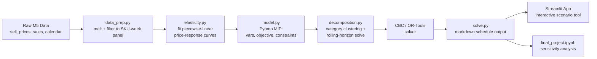

# markdown-price-optimizer

MIP model for retail markdown scheduling — optimal weekly discount tiers per SKU to maximize revenue before a clearance deadline. Built with Pyomo, CBC, and Streamlit.

[](https://github.com/hkbuttar/markdown-price-optimizer/actions/workflows/tests.yml)
[](https://hkbuttar.streamlit.app)
[](LICENSE)

## Overview

Retailers carrying seasonal or perishable-demand inventory must repeatedly decide how deeply to discount each product, each week, in the remaining selling window. This project formulates that decision as a Mixed-Integer Program (MIP): a discrete price-tier selection per SKU per week, subject to inventory conservation, a clearance deadline, monotonic pricing, and a margin floor, with demand response to price approximated as a piecewise-linear curve via SOS2 constraints.

Because solving all SKUs jointly at full weekly granularity is computationally impractical, the model uses a hybrid approach: SKUs are clustered by category and solved with a rolling-horizon decomposition — each sub-problem solved to proven optimality, stitched together heuristically.

## Live Demo

**[Try the app →](https://hkbuttar.streamlit.app)**

Upload an inventory/price file and get back a recommended weekly markdown calendar — no local setup required.


*Screenshot placeholder — replace `outputs/screenshots/app_demo.png` with an actual screenshot or GIF of the running app once deployed.*

## Architecture



## Results

Recovered revenue across all modeled departments (4,834 SKU-store pairs, ~15.9% of the full HOBBIES/FOODS/HOUSEHOLD catalog, after filtering for elasticity fit reliability, economic plausibility, and structural feasibility — see Data/Modeling Assumptions below):

| Policy | Recovered Revenue | vs. MIP |
|---|---|---|
| **MIP-optimized schedule (hybrid decomposition)** | $438,202.26 | — |
| Flat 20% discount (naive baseline) | $354,659.69 | −23.6% |
| Calendar-based markdown (10/20/30/50 by week) | $391,296.26 | −12.0% |

> The MIP-optimized schedule recovers **23.6% more revenue** than a naive flat-discount policy and **12.0% more** than a standard calendar-based clearance schedule, across the modeled subset.

**Per-department breakdown:**

| Department | Recovered Revenue | Rolling-Horizon Windows Solved | Feasible |
|---|---|---|---|
| FOODS_1 | $25,243.85 | 207 | ✅ |
| FOODS_2 | $36,948.81 | 276 | ✅ |
| FOODS_3 | $119,474.80 | 552 | ✅ |
| HOBBIES_1 | $89,341.21 | 1,035 | ✅ |
| HOBBIES_2 | $1,271.26 | 69 | ✅ |
| HOUSEHOLD_1 | $158,619.70 | 1,311 | ✅ |
| HOUSEHOLD_2 | $7,302.64 | 138 | ✅ |
| **Total** | **$438,202.26** | **3,588** | **All feasible** |

Solved in ~19.4 minutes (1,161.9s) across all 7 departments using hybrid decomposition (department clustering + SKU batching + rolling horizon) on CPU only — no GPU required. Full methodology, including the elasticity-quality filtering process, is documented in `notebooks/final_project.ipynb` and the project proposal.

## Repository Structure

```
markdown-price-optimizer/
├── README.md                     # this file
├── LICENSE                        # MIT license
├── requirements.txt               # pinned Python dependencies
├── packages.txt                   # apt-level deps for Streamlit Cloud (CBC solver)
├── .gitignore                     # excludes data/raw, .venv, __pycache__
│
├── .github/
│   └── workflows/
│       └── tests.yml              # CI: runs pytest on every push/PR
│
├── data/
│   ├── raw/                       # sell_prices.csv, sales_train_evaluation.csv, calendar.csv (gitignored)
│   └── processed/                 # cleaned/melted SKU-week panel used by the model
│
├── notebooks/
│   └── final_project.ipynb        # deliverable notebook: EDA → elasticity estimation
│                                   # → MIP formulation → solve → sensitivity analysis
│
├── src/
│   ├── data_prep.py                # loads raw M5 files, melts to long format, filters to a category subset
│   ├── elasticity.py                # fits price-response curves per SKU/category
│   ├── model.py                     # Pyomo MIP: variables, objective, constraints, SOS2 setup
│   ├── decomposition.py             # category clustering + rolling-horizon solve loop
│   └── solve.py                     # orchestrates: build model, call solver, return schedule
│
├── app/
│   └── streamlit_app.py            # UI: upload inventory/prices, run solve, show markdown calendar
│
├── tests/
│   └── test_model.py                # feasibility & inventory-conservation sanity checks
│
└── outputs/
    ├── sample_markdown_schedule.csv # example solved output for the deck/demo
    └── screenshots/
        └── app_demo.png            # screenshot or GIF of the Streamlit app in action
```

## Data

Source: [M5 Forecasting Accuracy dataset](https://www.kaggle.com/competitions/m5-forecasting-accuracy/data) (Walmart, public).

Place these three files in `data/raw/` (not tracked in git — see `.gitignore`):

| File | Purpose |
|---|---|
| `sell_prices.csv` | Price per store/item/week — core input for elasticity estimation |
| `sales_train_evaluation.csv` | Item-level daily unit sales (wide format, `d_1`...`d_n` columns) |
| `calendar.csv` | Maps `d_1`...`d_n` to real dates; flags events/SNAP days |

`sales_train_evaluation.csv` is large and wide. `data_prep.py` melts it to long format (`item_id, store_id, date, units_sold`) and filters to a manageable category subset before anything downstream touches it.

## Setup

Requires Python 3.10+ and a MIP solver (CBC, via COIN-OR).

```bash
# clone and enter the repo
git clone https://github.com/hkbuttar/markdown-price-optimizer.git
cd markdown-price-optimizer

# create and activate a virtual environment
python -m venv .venv
source .venv/bin/activate        # Windows: .venv\Scripts\activate

# install Python dependencies
pip install -r requirements.txt

# install the CBC solver
# macOS:   brew install cbc
# Ubuntu:  sudo apt-get install coinor-cbc
# Windows: conda install -c conda-forge coincbc
```

Place the three raw data files in `data/raw/` as described above.

## Running the Project

**Notebook (main deliverable):**
```bash
jupyter lab notebooks/final_project.ipynb
```
Runs end-to-end: data prep → elasticity fitting → MIP construction → solve → sensitivity/scenario analysis.

**Command line:**
```bash
python -m src.data_prep
python -m src.solve --category "FOODS" --weeks 12
```

**Streamlit app (local):**
```bash
streamlit run app/streamlit_app.py
```

**Tests:**
```bash
pytest tests/
```

## Deployment

The Streamlit app is deployed to [Streamlit Community Cloud](https://share.streamlit.io) so it's demoable from a persistent URL without a local terminal running.

Live demo: `https://<your-app-name>.streamlit.app` *(update once deployed)*

`packages.txt` tells Streamlit Cloud's build to install the CBC solver at the system level via apt:
```
coinor-cbc
```

## Continuous Integration

Every push and pull request to `main` triggers `.github/workflows/tests.yml`, which installs dependencies (including the CBC solver) and runs the test suite in `tests/`. The badge at the top of this README reflects the current build status.

## Model Summary

- **Objective:** maximize total recovered revenue across all SKUs and weeks in the clearance horizon.
- **Decision variables:** binary discount-tier selection per SKU per week (0%, 10%, 20%, 30%, 50% off), plus continuous units-sold variables driven by the piecewise-linear demand response.
- **Constraints:**
  - Inventory conservation — cumulative units sold ≤ starting stock, per SKU
  - End-of-horizon clearance — ≥95% of units sold by the deadline, with a salvage-value penalty on any remainder
  - Monotonic pricing — discounts cannot decrease week over week
  - Margin floor — price cannot drop below cost + minimum margin, except in a designated final emergency-clearance week
- **Solution approach:** exact MIP solve per SKU cluster (CBC via Pyomo; OR-Tools CP-SAT as fallback), combined with category clustering and rolling-horizon decomposition to keep the full-catalog problem tractable — an explicit, justified trade-off of global optimality for solve-time feasibility.

## Requirements (`requirements.txt`)

```
pyomo
pandas
numpy
scikit-learn
matplotlib
streamlit
pytest
```

## Reproducibility Notes

- Random seeds are fixed in `elasticity.py` and `decomposition.py` for consistent regression fits and cluster assignments across runs.
- All file paths are relative to the repo root; run scripts/notebooks from the top-level directory.
- The `outputs/sample_markdown_schedule.csv` file is a checked-in example so results can be inspected without re-running the full pipeline.

## License

This project is licensed under the MIT License — see [LICENSE](LICENSE) for details.

## Team / Course Context

Final project for Optimization and Simulation, MS in Applied Data Science, University of Chicago.